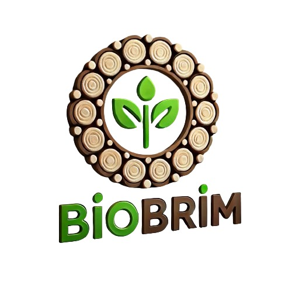

# BIOBRIM Platform

A comprehensive web application for trading biomass pellets between farmers and companies.



## Overview

BIOBRIM is a full-stack web application designed to connect farmers who produce biomass pellets with companies that need them for various industrial purposes. The platform eliminates middlemen, creating a direct marketplace for sustainable biomass trading.

## Key Features

- **Dual User Roles**: Separate interfaces for farmers and companies
- **Pellet Listings**: Farmers can list their biomass pellets with detailed information
- **Requirements Posting**: Companies can post their specific biomass needs
- **Offer System**: Negotiation system for quantities and prices
- **Order Management**: Complete order tracking from processing to delivery
- **User Profiles**: Detailed profiles for both farmers and companies
- **Responsive Design**: Works seamlessly on desktop and mobile devices

## Technology Stack

- **Backend**: Flask (Python web framework)
- **Database**: PostgreSQL with SQLAlchemy ORM
- **Authentication**: Flask-Login for user session management
- **Forms**: Flask-WTF and WTForms for form validation
- **Frontend**: Bootstrap 5 with custom styling
- **Deployment**: Gunicorn WSGI server

## Screenshots

### Landing Page
A clean, informative landing page for visitors to learn about the platform before registering.

### Farmer Dashboard
Farmers can manage their pellet listings, view offers, and track orders from this centralized dashboard.

### Company Dashboard
Companies have a dedicated dashboard to discover pellets, post requirements, and manage their orders.

## Getting Started

See the [SETUP_GUIDE.md](SETUP_GUIDE.md) for detailed instructions on how to set up and run the application locally.

## Project Structure

```
├── app.py               # App configuration and initialization
├── main.py              # Application entry point
├── auth.py              # Authentication routes
├── farmer_routes.py     # Routes for farmer functionality
├── company_routes.py    # Routes for company functionality
├── forms.py             # Form definitions
├── models.py            # Database models
├── static/              # Static assets
│   ├── css/             # CSS stylesheets
│   └── js/              # JavaScript files
└── templates/           # Jinja2 templates
    ├── base.html        # Base template
    ├── landing.html     # Landing page
    ├── login.html       # Login page
    ├── register.html    # Registration page
    ├── farmer/          # Farmer-specific templates
    └── company/         # Company-specific templates
```

## Future Enhancements

- Messaging system between users
- Payment integration
- Advanced search and filtering
- Verification system for users
- Analytics dashboard
- Mobile app version

## License

This project is licensed under the MIT License - see the LICENSE file for details.

## Acknowledgments

- Special thanks to all contributors
- Inspired by the need for sustainable energy solutions